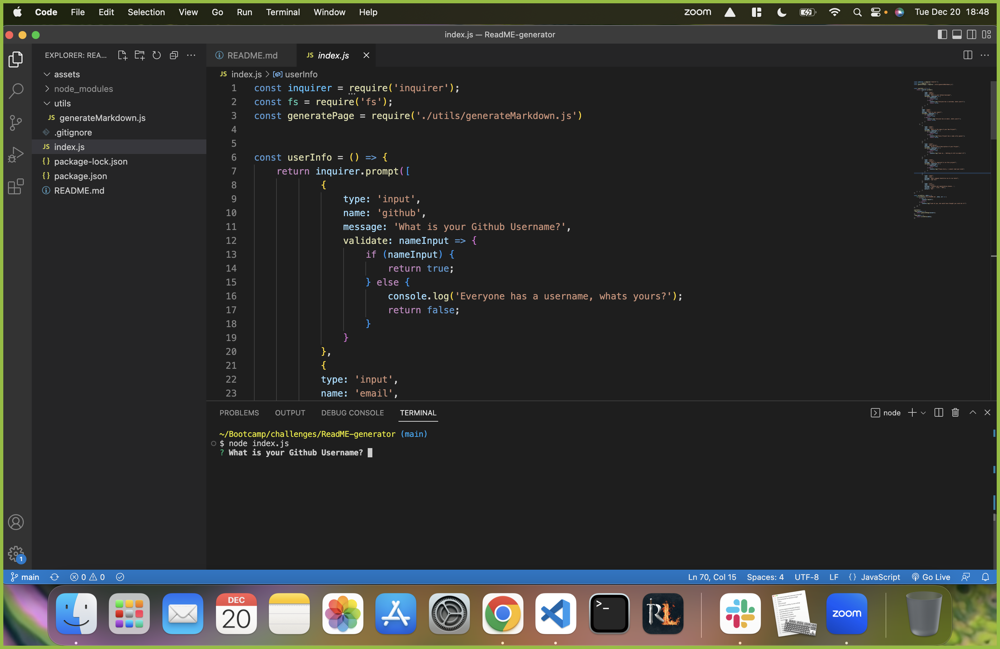
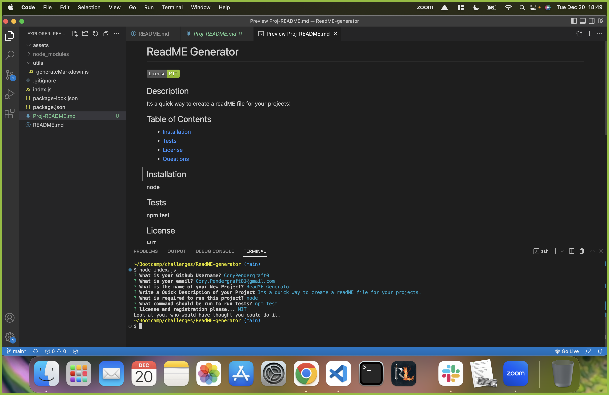

# ReadME Generator!!

## Project link
[Here is a link to the Screen Recording](https://drive.google.com/file/d/1JvCHXNfGbFZ5Jea-N4uxuGmh53VMvxC6/view)

## Table of contents
- [Description](#description)

- [Visuals](#visuals)

## Description
This weeks homework was to build a "readME generator" using everything we learned from node. The ReadME was created by a prompt and several 'inputs'. Get one genetrated by typing "node index.js" into your terminal to get started! Once completed, it will create a new file called "Proj-ReadME'. Open the file to view your finished product.

## Visuals
;

;
